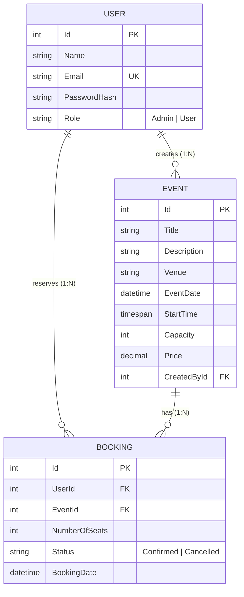

# University Event Booking System

A full-stack university **Event Booking System** built with **Angular** and **ASP.NET Core Web API**, powered by **Entity Framework Core** and **PostgreSQL**.

---

## Table of Contents

- [Project Overview](#project-overview)
- [Features](#features)
- [Tech Stack](#tech-stack)
- [Project Architecture & Structure](#project-architecture--structure)
- [Prerequisites](#prerequisites)
- [Database Setup](#database-setup)
- [Backend Setup & Run](#backend-setup--run)
- [Frontend Setup & Run](#frontend-setup--run)
- [Environment Configuration](#environment-configuration)
- [API Documentation](#api-documentation)
- [Running Automated Tests](#running-automated-tests)
- [Entity-Relationship (ER) Diagram](#entity-relationship-er-diagram)

---

## Project Overview

The **University Event Booking System** provides a centralized platform for discovering campus events, booking seat reservations, managing tickets, and administering events.

### User Roles & Permissions

| Role | Permissions & Access |
|---|---|
| **Anonymous Visitor** | Browse public event catalog, filter events by date/venue, paginate results, and view event details. |
| **Authenticated User** | Everything above, plus reserve seats (`POST /api/bookings`), view personal booking history (`GET /api/bookings/my`), and cancel owned reservations (`PUT /api/bookings/{id}/cancel`). |
| **Admin** | Everything above, plus full Event CRUD (`POST`, `PUT`, `DELETE /api/events`), view the Admin Dashboard with summary metrics, view all system bookings across all attendees, and cancel any booking. |

### Core Booking Workflow

```text
[Anonymous / User] -> Browse Catalog -> Filter / Paginate -> View Event Details
                              ↓
                      [Sign In / Register]
                              ↓
              [Book Now] -> Specify Seat Quantity -> Dynamic Total Calculation
                              ↓
                [Backend Serializable Transaction]
              (Checks Event Capacity - SUM(Confirmed Bookings))
                   /                             \
     (Capacity Available)                  (Capacity Exceeded)
            ↓                                     ↓
    [201 Booking Confirmed]              [409 Conflict: Seats Available]
            ↓                                     ↓
     [My Bookings]                         [UI Error Feedback]
            ↓
  [Cancel Reservation] -> [Status = Cancelled] -> [Capacity Instantly Restored]
```

---

## Features

- **Authentication & Security**: Secure user registration and login using BCrypt password hashing and HMAC-SHA256 JWT Bearer tokens with role claims (`Admin`, `User`).
- **Role-Based Authorization**: Protected backend controller endpoints (`[Authorize(Roles = "Admin")]`) and Angular functional route guards (`authGuard`, `adminGuard`).
- **Event Management (CRUD)**: Admin interface to create, update, and delete events with future date validation and foreign-key integrity enforcement.
- **Search & Filtering**: Server-side filtering by **Event Date** (`YYYY-MM-DD`) and **Venue** (`string` query match).
- **Server-Side Pagination**: Efficient pagination (`page`, `pageSize`) returning page metadata, total counts, and previous/next indicators.
- **Real-Time Seats Left & Availability**: Dynamic backend calculation: `AvailableSeats = Capacity - SUM(Confirmed Seats)`. Color-coded status badges (`X seats left` or `Sold Out`) and automatic disabling of booking actions when an event reaches capacity.
- **Concurrency & Overbooking Protection**: Booking creation runs in an atomic `IsolationLevel.Serializable` database transaction to prevent race-condition overbooking.
- **Reservation History & Cancellation**: Users can view their personal bookings and cancel active reservations. Cancelled bookings remain in history with status `Cancelled` and immediately restore seat capacity for other attendees.
- **Admin Dashboard**: System overview with live metric count cards (Total Events, Total Bookings, Confirmed, Cancelled) and all-attendee reservations table with admin cancellation triggers.
- **Global Toast Notification Service**: Signal-based alert and toast notification overlay for success, warning, info, and error feedback across all components.
- **Responsive & Accessible UI**: Responsive layouts for Desktop, Tablet, and Mobile devices with accessible status pills (`✓ CONFIRMED` / `✕ CANCELLED`).

---

## Tech Stack

### Frontend
- **Framework**: Angular 22 (Standalone Components)
- **Language**: TypeScript
- **Styling**: SCSS (CSS3 Flexbox & CSS Grid, responsive design)
- **State & Reactivity**: Angular Signals & RxJS Observables
- **Forms**: Reactive Forms (`FormBuilder`, custom & built-in validators)
- **Routing & Interceptors**: Functional Route Guards & `HttpInterceptorFn` (JWT Bearer attachment)

### Backend
- **Framework**: ASP.NET Core Web API (.NET 8 LTS)
- **Language**: C# 12
- **ORM**: Entity Framework Core 8
- **Database Provider**: Npgsql.EntityFrameworkCore.PostgreSQL
- **Database**: PostgreSQL 16+
- **Security**: JWT Bearer Authentication (`Microsoft.AspNetCore.Authentication.JwtBearer`), BCrypt Password Hashing (`BCrypt.Net-Next`)
- **API Documentation**: Swagger / OpenAPI (`Swashbuckle.AspNetCore`)

### Automated Testing
- **Test Framework**: xUnit (.NET 8)
- **Mocking**: Moq
- **Database Isolation**: SQLite In-Memory (`Microsoft.EntityFrameworkCore.Sqlite`)

---

## Project Architecture & Structure

```
Internship/
├── EventBookingSystem.sln              # Root .NET Solution file
├── README.md                           # Master documentation
├── EventBookingBackend/                # ASP.NET Core Web API project
│   ├── Controllers/
│   │   ├── AuthController.cs           # /api/auth/register, /api/auth/login
│   │   ├── EventsController.cs         # /api/events (CRUD, filters, pagination)
│   │   └── BookingsController.cs       # /api/bookings (Create, My, All, Cancel)
│   ├── Data/
│   │   └── AppDbContext.cs             # EF Core DbContext with Fluent API configuration
│   ├── DTOs/
│   │   ├── AuthResponseDto.cs
│   │   ├── BookingDto.cs
│   │   ├── CreateBookingDto.cs
│   │   ├── CreateEventDto.cs
│   │   ├── EventDto.cs
│   │   ├── LoginDto.cs
│   │   ├── PaginatedResult.cs
│   │   ├── RegisterDto.cs
│   │   └── UpdateEventDto.cs
│   ├── Migrations/                     # EF Core Code-First database migrations
│   ├── Models/
│   │   ├── Booking.cs                  # Booking entity
│   │   ├── Enums/
│   │   │   ├── BookingStatus.cs        # Confirmed, Cancelled
│   │   │   └── Role.cs                 # Admin, User
│   │   ├── Event.cs                    # Event entity
│   │   └── User.cs                     # User entity
│   ├── Services/
│   │   ├── AuthService.cs              # BCrypt verify/hash & JWT generation
│   │   ├── BookingService.cs          # Capacity calculation & serializable transactions
│   │   └── EventService.cs            # Event query, filter, pagination & CRUD
│   ├── Program.cs                      # Dependency injection, middleware & security pipeline
│   └── appsettings.json                # Application configuration & connection template
├── EventBookingBackend.Tests/          # Unit test suite
│   ├── EventBookingBackend.Tests.csproj
│   └── Services/
│       └── BookingServiceTests.cs      # 10 isolated xUnit tests covering booking logic
└── event-booking-frontend/             # Angular 22 frontend application
    ├── src/
    │   ├── app/
    │   │   ├── admin/
    │   │   │   └── admin-dashboard/    # Metrics grid & all bookings data table
    │   │   ├── auth/
    │   │   │   ├── login/              # Reactive login form
    │   │   │   └── register/           # Registration with password match validation
    │   │   ├── bookings/
    │   │   │   ├── booking-form/       # Dynamic seat booking & confirmation receipt
    │   │   │   ├── my-bookings/        # Personal bookings view & cancellation
    │   │   │   ├── models/             # Booking TypeScript interfaces
    │   │   │   └── booking.service.ts  # Booking HTTP client service
    │   │   ├── core/
    │   │   │   ├── guards/             # authGuard, adminGuard
    │   │   │   ├── interceptors/       # authInterceptor (JWT Bearer)
    │   │   │   ├── models/             # Auth TypeScript models
    │   │   │   └── services/           # auth.service.ts, notification.service.ts
    │   │   ├── events/
    │   │   │   ├── event-detail/       # Event hero, availability breakdown & booking link
    │   │   │   ├── event-form/         # Admin event create/edit reactive form
    │   │   │   ├── event-list/         # Public catalog, filter bar & pagination controls
    │   │   │   ├── models/             # Event TypeScript models
    │   │   │   └── event.service.ts    # Event HTTP client service
    │   │   ├── app.config.ts           # Application providers & HTTP interceptors
    │   │   ├── app.html                # Navigation bar & global toast overlay
    │   │   ├── app.routes.ts           # Client-side route configuration
    │   │   └── app.ts                  # Root component
    │   ├── environments/               # environment.ts & environment.development.ts
    │   └── styles.scss                 # Global design system
    ├── angular.json
    └── package.json
```

---

## Prerequisites

Ensure the following tools are installed on your workstation:

- **.NET SDK**: .NET 8.0 SDK or newer ([Download .NET 8](https://dotnet.microsoft.com/download/dotnet/8.0))
- **Node.js**: Node.js v20.x+ or v22.x LTS ([Download Node.js](https://nodejs.org/))
- **PostgreSQL**: PostgreSQL 16 or newer ([Download PostgreSQL](https://www.postgresql.org/download/))
- **Git**: Git version control tool

---

## Database Setup

1. **Start PostgreSQL server** on your local machine (default port: `5432`).
2. **Create the database** (e.g. `event_booking_db`):
   ```sql
   CREATE DATABASE event_booking_db;
   ```
3. **Configure the Connection String**:
   You can supply your PostgreSQL password via environment variable or in `appsettings.Development.json`.

   *PowerShell Example:*
   ```powershell
   $env:ConnectionStrings__DefaultConnection = "Host=localhost;Port=5432;Database=event_booking_db;Username=postgres;Password=YOUR_POSTGRES_PASSWORD"
   ```

4. **Apply EF Core Migrations**:
   Run the following command from the `EventBookingBackend` folder:
   ```powershell
   cd EventBookingBackend
   dotnet ef database update
   ```

---

## Backend Setup & Run

1. **Navigate to the backend folder**:
   ```powershell
   cd EventBookingBackend
   ```
2. **Restore dependencies**:
   ```powershell
   dotnet restore
   ```
3. **Build the project**:
   ```powershell
   dotnet build
   ```
4. **Run the API server**:
   ```powershell
   dotnet run --launch-profile http
   ```
5. **Access Endpoints**:
   - API Base URL: `http://localhost:5000`
   - Swagger Interactive Documentation: `http://localhost:5000/swagger`

---

## Frontend Setup & Run

1. **Navigate to the frontend folder**:
   ```powershell
   cd event-booking-frontend
   ```
2. **Install npm dependencies**:
   ```powershell
   npm install
   ```
3. **Start Angular development server**:
   ```powershell
   npm start
   ```
   *(or `npx ng serve --port 4200`)*
4. **Open in Browser**:
   - Frontend Application: `http://localhost:4200`

---

## Environment Configuration

### Backend Configuration (`EventBookingBackend/appsettings.json`)

```json
{
  "ConnectionStrings": {
    "DefaultConnection": "Host=localhost;Port=5432;Database=event_booking_db;Username=postgres;Password=YOUR_PASSWORD_HERE"
  },
  "Jwt": {
    "Key": "YOUR_SUPER_SECRET_HMAC_SHA256_KEY_MINIMUM_32_CHARACTERS",
    "Issuer": "EventBookingBackend",
    "Audience": "EventBookingFrontend",
    "ExpiresInMinutes": 120
  },
  "AllowedHosts": "*"
}
```

> **Security Note**: Never commit actual database passwords or production JWT secrets to source control. Use environment variables (e.g. `$env:ConnectionStrings__DefaultConnection`) or .NET User Secrets in development.

### Frontend Configuration (`event-booking-frontend/src/environments/environment.ts`)

```typescript
export const environment = {
  production: false,
  apiUrl: 'http://localhost:5000/api'
};
```

---

## API Documentation

### 1. Authentication Endpoints

#### `POST /api/auth/register`
- **Access**: Public
- **Description**: Registers a new attendee user (`Role: User`).
- **Request Body**:
  ```json
  {
    "name": "Alice Johnson",
    "email": "alice@university.edu",
    "password": "Password123!"
  }
  ```
- **Responses**:
  - `201 Created`: Returns JWT token and user profile.
  - `400 Bad Request`: Validation failure.
  - `409 Conflict`: Email is already registered.

#### `POST /api/auth/login`
- **Access**: Public
- **Description**: Authenticates user and generates JWT token.
- **Request Body**:
  ```json
  {
    "email": "alice@university.edu",
    "password": "Password123!"
  }
  ```
- **Responses**:
  - `200 OK`:
    ```json
    {
      "token": "eyJhbGciOiJIUzI1NiIsInR5cCI6IkpXVCJ9...",
      "user": {
        "id": 2,
        "name": "Alice Johnson",
        "email": "alice@university.edu",
        "role": "User"
      }
    }
    ```
  - `401 Unauthorized`: Invalid email or password.

---

### 2. Event Endpoints

#### `GET /api/events`
- **Access**: Public
- **Query Parameters**:
  - `page` *(int, default: 1)*: Page number.
  - `pageSize` *(int, default: 6)*: Number of items per page.
  - `date` *(string, optional)*: Filter by event date (`YYYY-MM-DD`).
  - `venue` *(string, optional)*: Case-insensitive venue filter.
- **Response**:
  - `200 OK`:
    ```json
    {
      "items": [
        {
          "id": 1,
          "title": "University Tech Conference",
          "description": "Annual student tech conference",
          "venue": "Auditorium Hall",
          "eventDate": "2027-04-15T09:00:00Z",
          "startTime": "09:00:00",
          "capacity": 200,
          "price": 15.00,
          "createdById": 1,
          "createdByName": "Admin",
          "availableSeats": 180
        }
      ],
      "totalCount": 1,
      "page": 1,
      "pageSize": 6,
      "totalPages": 1,
      "hasPreviousPage": false,
      "hasNextPage": false
    }
    ```

#### `GET /api/events/{id}`
- **Access**: Public
- **Responses**:
  - `200 OK`: Returns single event with `availableSeats`.
  - `404 Not Found`: Event ID does not exist.

#### `POST /api/events`
- **Access**: `[Authorize(Roles = "Admin")]`
- **Request Body**:
  ```json
  {
    "title": "AI & Robotics Workshop",
    "description": "Hands-on machine learning session",
    "venue": "Engineering Lab 3",
    "eventDate": "2027-05-10T14:00:00Z",
    "startTime": "14:00:00",
    "capacity": 50,
    "price": 0.00
  }
  ```
- **Responses**:
  - `201 Created`: Returns newly created `EventDto`.
  - `400 Bad Request`: Validation failure (e.g. event date in past).
  - `401 Unauthorized` / `403 Forbidden`: Non-admin access.

#### `PUT /api/events/{id}`
- **Access**: `[Authorize(Roles = "Admin")]`
- **Responses**:
  - `200 OK`: Returns updated `EventDto`.
  - `404 Not Found`: Event ID does not exist.

#### `DELETE /api/events/{id}`
- **Access**: `[Authorize(Roles = "Admin")]`
- **Responses**:
  - `200 OK`: `{ "message": "Event with ID 1 deleted successfully." }`
  - `400 Bad Request`: Event has existing bookings (cannot delete).
  - `404 Not Found`: Event not found.

---

### 3. Booking Endpoints

#### `POST /api/bookings`
- **Access**: Authenticated (`Bearer <JWT>`)
- **Description**: Atomically reserves seats inside a serializable transaction.
- **Request Body**:
  ```json
  {
    "eventId": 1,
    "numberOfSeats": 2
  }
  ```
- **Responses**:
  - `201 Created`:
    ```json
    {
      "id": 10,
      "userId": 2,
      "userName": "Alice Johnson",
      "userEmail": "alice@university.edu",
      "eventId": 1,
      "eventTitle": "University Tech Conference",
      "numberOfSeats": 2,
      "status": "Confirmed",
      "bookingDate": "2026-08-25T12:00:00Z"
    }
    ```
  - `409 Conflict`:
    ```json
    {
      "message": "Not enough seats available for this event.",
      "availableSeats": 1
    }
    ```
  - `404 Not Found`: Event does not exist.

#### `GET /api/bookings/my`
- **Access**: Authenticated (`Bearer <JWT>`)
- **Description**: Returns all bookings for the currently authenticated user.
- **Responses**:
  - `200 OK`: List of `BookingDto` objects ordered newest first.

#### `GET /api/bookings`
- **Access**: `[Authorize(Roles = "Admin")]`
- **Description**: Returns all system bookings across all attendees.
- **Responses**:
  - `200 OK`: Complete list of `BookingDto` objects.
  - `403 Forbidden`: Regular user access.

#### `PUT /api/bookings/{id}/cancel`
- **Access**: Authenticated (`Bearer <JWT>`)
- **Description**: Cancels a confirmed booking. Owner can cancel their own; Admin can cancel any booking.
- **Responses**:
  - `200 OK`: `{ "message": "Booking cancelled successfully.", "booking": { ... } }`
  - `400 Bad Request`: Booking was already cancelled.
  - `403 Forbidden`: User attempts to cancel another attendee's booking.
  - `404 Not Found`: Booking ID does not exist.

---

## Running Automated Tests

The unit test suite uses **xUnit**, **Moq**, and **SQLite In-Memory** database isolation to test backend business logic deterministically without requiring an external PostgreSQL database.

### Execute Tests via .NET CLI

From the project root directory:

```powershell
dotnet test
```

### Test Suite Coverage (`BookingServiceTests`)

| Test Case | Scenario Tested |
|---|---|
| `CreateBooking_WhenSeatsAreWithinCapacity_CreatesConfirmedBooking` | Verifies successful reservation creation and database persistence when requested seats are within remaining capacity. |
| `CreateBooking_WhenSeatsExceedCapacity_RejectsBooking` | Verifies that requesting more seats than remaining capacity rejects the booking with `409 Conflict` feedback and creates no records. |
| `CancelBooking_WhenBookingIsConfirmed_SetsStatusToCancelledAndFreesCapacity` | Verifies that cancelling a booking updates status to `Cancelled` and immediately frees capacity for new reservations. |
| `CreateBooking_WhenEventDoesNotExist_ReturnsNotFoundResult` | Verifies handling of non-existent event IDs. |
| `CancelBooking_WhenBookingDoesNotExist_ReturnsFoundFalse` | Verifies 404 response for invalid booking IDs. |
| `CancelBooking_WhenAlreadyCancelled_ReturnsAlreadyCancelledTrue` | Verifies idempotency and prevents duplicate cancellations. |
| `CancelBooking_WhenUnauthorizedUserAttemptsCancellation_ReturnsAuthorizedFalse` | Verifies that regular users cannot cancel reservations owned by other attendees. |
| `CancelBooking_WhenAdminCancelsAnyUserBooking_ReturnsAuthorizedTrue` | Verifies that Admin users have authority to cancel any reservation. |
| `GetMyBookings_ReturnsOnlyCurrentUserBookings` | Verifies that personal booking queries strictly isolate data to the authenticated user. |
| `GetAllBookings_ReturnsAllBookingsChronologically` | Verifies that the admin query returns all system bookings ordered chronologically. |

---

## Entity-Relationship (ER) Diagram

### Entity Relationships

1. **User (1) ────< (N) Event**: An admin user can create many events (`Events.CreatedById -> Users.Id`, `DeleteBehavior.Restrict`).
2. **User (1) ────< (N) Booking**: A user can make multiple bookings across different events (`Bookings.UserId -> Users.Id`, `DeleteBehavior.Restrict`).
3. **Event (1) ────< (N) Booking**: An event can have multiple seat reservations (`Bookings.EventId -> Events.Id`, `DeleteBehavior.Restrict`).

### Capacity Business Rule
```text
Available Seats = Event.Capacity - SUM(Bookings.NumberOfSeats WHERE Bookings.Status == 'Confirmed')
```
*Cancelled bookings (`Status = 'Cancelled'`) are retained in the database for auditing and history, but do not contribute to occupied capacity.*

### Mermaid ER Diagram



---

## License

This project was developed for educational and internship assessment purposes.
